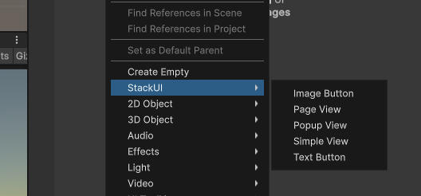
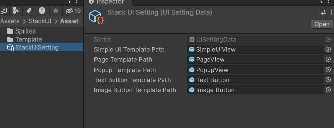
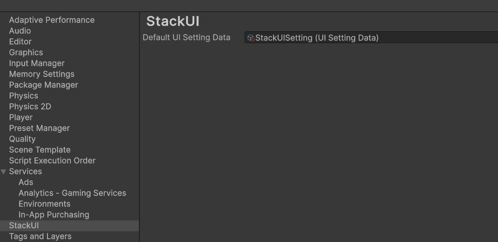

# StackUI

轻量、直观、可落地的 Unity 栈式 UI 框架。  
用最少代码完成页面导航、弹窗叠加、生命周期管理与资源缓存控制。


---

## 主要功能

| 核心能力 | 说明 |核心 API | 
| --- |--- |--- |
| 栈式导航 | 提供栈式的页面打开、后退等导航功能  | `Navigation.Push` / `Navigation.Pop` / `Navigation.CanPop` 等系列方法|
| 页面参数 |  页面切换时支持传递上下文参数 | `Navigation.Push` / `Navigation.Pop`  等系列方法|
| 历史裁剪 |  栈式链路中根据条件把某一段页面路径去除 |`Navigation.PushAndRemoveAll` / `Navigation.PushAndRemoveUntil` / `Navigation.PopUntil` /`Navigation.Clear`|
| 弹窗管理 |  弹窗叠加显示在页面上 |`Navigation.ShowWin` / `Navigation.HideWin` / `Navigation.ExistWin` / `Navigation.GetWin` |
| 生命周期 |  可重写弹窗和页面全生命周期|`Presenter.OnAssetLoaded` `Presenter.OnInit` / `Presenter.OnReInit` / `Presenter.OnClose` / `Presenter.OnDispose` |
| 资源策略 |  可单独控制某个页面具体使用资源和缓存策略|`Navigation.SetDontDestroyAsset` / `Navigation.SetAssetName` `Navigation.AddTable` |
| 事件管理 |  自动回收UI事件|`Presenter.ListenUnity` |
| UI模板 |  自定义UI风格 方便编辑器里直接创建| 无 |

---

## 框架设计

* Navigation 负责页面 窗口管理，提供了控制页面和获取状态的方法
* Presenter 负责业务逻辑 ，由用户继承
* View 负责界面显示，由用户继承


## 生命周期（Presenter）

| 回调 | 触发时机 | 常见用途 |
| --- | --- | --- |
| `OnAssetLoaded()` | 资源首次加载或重载后 | 初始化一次性资源 |
| `OnInit(object arg)` | 界面从关闭 -> 打开 | 绑定事件、根据参数初始化界面 |
| `OnReInit(object arg)` | 已打开状态下再次打开 | 刷新数据、局部重绘 |
| `OnClose()` | 界面关闭（隐藏/销毁前） | 停止逻辑 |
| `OnDispose()` | 资源销毁前（仅销毁路径） | 清理资源 |

---

## 安装方式

下载项目整个拷贝到项目Assets根路径下，或者使用推荐方式：    

使用包管理器 Install package from git URL，填入 https://github.com/Eashiong/StackUI

### 导入示例

里面提供了一些使用例子，请查看。如果是下载项目导到到工程的 请把Demo~ 文件改名为Demo 即就会把示例自动导入到工程中

如果是使用使用包管理器安装的，可以直接从包管理器安装示例


---

## 快速开始

### 1）注册页面

```csharp
using StackUI;
using UnityEngine;

public class AppEntry : MonoBehaviour
{
    void Start()
    {
        Navigation.AddTable<LoginPresenter>("UI/LoginView");
        Navigation.AddTable<HomePresenter>("UI/HomeView");
        Navigation.Push<LoginPresenter>();
    }
}
```

### 2）定义 View

```csharp
using StackUI;

public class LoginView : View
{
    public UIButton loginBtn;
}
```

### 3）定义 Presenter

```csharp
using StackUI;

public class LoginPresenter : Presenter<LoginView>
{
    public override void OnInit(object arg)
    {
        ListenUnity(view.loginBtn.onClick, OnLoginClick);
    }

    private void OnLoginClick()
    {
        Navigation.PopAndPush<HomePresenter>("from login");
    }
}
```

---

## 特殊场景举例

| 业务场景 | 推荐 API |说明 |
| --- | --- |--- |
| 登录成功后进入主页，后续后退时候不需要返回登录页 | `PopAndPush` |把主页与登录页进行置换 |
| 支付完成后回到主线并清理支付流程页 | `PushAndRemoveUntil` |可以跳过支付中间的一系列页面直接回到主线|
| 连续返回直到登录页 | `PopUntil` / `Clear + Push` | 强制退出登录 |
| 节日活动换皮 | `SetAssetName` | 可下次刷新或立即刷新页面皮肤 |


---


## 资源加载与缓存策略

### 默认行为

- 默认加载器：`Resources.Load + Instantiate`
- 默认缓存：`dontDestroy = true`（关闭后隐藏，不销毁）

### 注册时指定策略

```csharp
Navigation.AddTable<HomePresenter>("UI/HomeView", dontDestroy: false);
```

### 注册时使用自定义 Loader

```csharp
Navigation.AddTable<HomePresenter>(
    "UI/HomeView",
    dontDestroy: true,
    loader: CustomLoader
);

private GameObject CustomLoader(string assetName)
{
    var prefab = Resources.Load<GameObject>(assetName);
    return prefab == null ? null : Instantiate(prefab);
}
```

### 运行时换肤

```csharp
Navigation.SetAssetName<HomePresenter>("UI/HomeView_Festival");//下次打开界面时会自动生效
```

```csharp
//如果想立即生效 使用置换API
if(Navigation.IsCurrent<HomePresenter>())
{
    Navigation.PopAndPush<HomePresenter>();
}
```
---

## 常用查询接口

```csharp
var current = Navigation.CurrentInstance();
var currentId = Navigation.CurrentInstanceID();
bool isHome = Navigation.IsCurrent<HomePresenter>();
bool canBack = Navigation.CanPop();

bool hasBagWin = Navigation.ExistWin<BagWinPresenter>();
var bagWin = Navigation.GetWin<BagWinPresenter>();

string asset = Navigation.GetAssetName<HomePresenter>();
```

---

## 编辑器工具

### UI模板

* 支持右键创建模板UI    

 


* 自定义模板

在Assets面板右键创建一个 Setting Data资源 按需配置prefab



然后配置到Project Setting/StackUI 生效



---


